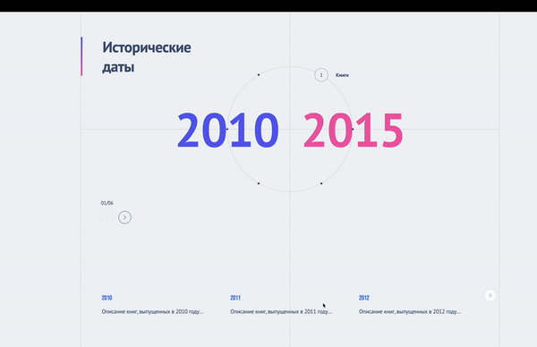
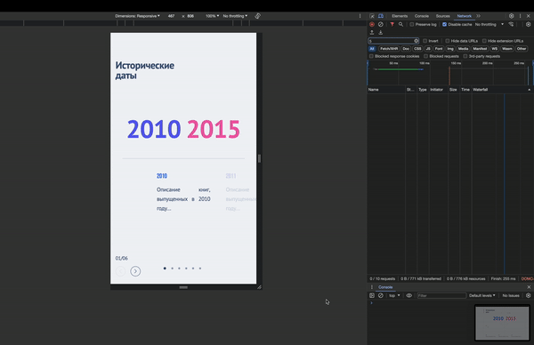

# Historical events webpage

The repository dedicated to pass the interview 

## prerequesites
 - node.js, npm

## installation

Clone the repository
```
 git clone https://github.com/Crampustallin/HistoricalEvents.git
```
Move to the cloned directory and execute the command below in your terminal (or powershell) 
```
npm install
```
After the packages installation proceed with the next command
```
npx webpack 
```

Start index.html from directory dist/




